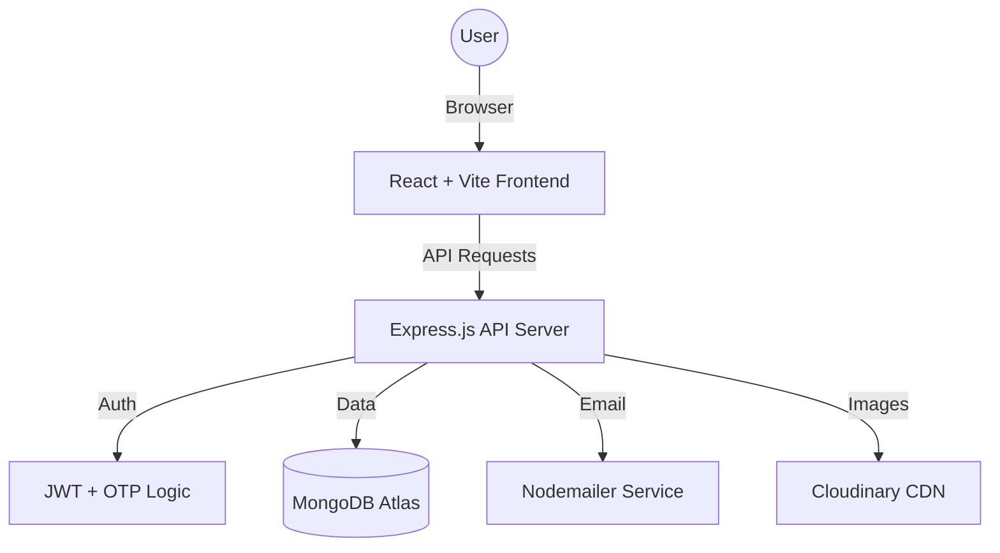

# Ghumo Jaipur 🏰🚇 — Smart Tourism & Local Transport Platform

[](https://opensource.org/licenses/MIT)
[](https://github.com/Ri2334/GhumoJaipur)
[](https://nodejs.org/)

**Ghumo Jaipur** is a comprehensive, production-ready MERN stack application designed to revolutionize the tourism experience in the Pink City. It combines the functionalities of travel discovery (TripAdvisor), ride-booking (Uber/Ola), and smart transit navigation (Google Maps) into a single, unified platform tailored for Jaipur.

---

## 🌟 Key Features

### 🔐 1. Secure Authentication & Identity
- **OTP-based Verification**: Secure signup and password reset using email-based OTP (Nodemailer).
- **JWT Authorization**: Stateless session management with JSON Web Tokens.
- **Protected Profiles**: User dashboards to manage personal information and saved trips.

### 🚗 2. Smart Transport Assistant
- **Multimodal Comparison**: Real-time comparison of Cabs, Autos, Buses, Metro, Shared Rides, and Walking.
- **Intelligent Recommendations**: Automatic badges for **Cheapest**, **Fastest**, and **Recommended** routes based on distance, traffic (simulated), and cost.
- **Distance Accuracy**: Uses the **Haversine Formula** for precise point-to-point distance calculations across Jaipur's coordinates.

### 🚇 3. Jaipur Metro Integration (Pink Line)
- **Station-to-Station Routing**: Complete mapping of the Jaipur Metro Pink Line from Mansarovar to Badi Chaupar.
- **Live Simulation**: Realistic wait times (averaging 4 mins), travel durations, and fare calculations (₹10–₹20).
- **Visual Timeline**: An interactive station sequence UI showing every stop and transfer point.

### 🚕 4. Cab & Auto Booking Flow
- **Interactive Booking**: Seamless flow from selection to confirmation.
- **Driver Allocation**: Realistic driver cards featuring names, ratings, vehicle details, and live ETA.
- **Payment Simulation**: A sleek, Razorpay-style interactive payment modal with processing states and success tracking.
- **Post-Booking Map**: Real-time route visualization using **Leaflet.js** and OpenStreetMap markers.

### 📱 5. Shared Ride (Pooling) System
- **Smart Matching**: Heuristic-based matching algorithm to find riders on similar routes.
- **Cost Splitting**: Automatically calculates split fares (saving up to 60%) and match probabilities.
- **Wait Window**: Features a 10–15 minute flexible window for optimized pooling.

### 🏰 6. Heritage Exploration
- **Discover Places**: A curated directory of 20+ tourist spots with high-res galleries, categories, and deep descriptions.
- **Local Guide Integration**: Fallback "Famous things to try nearby" logic using database-driven food and transport tips.
- **Visitor Reviews**: Community ratings and detailed feedback for every heritage site.

---

## 🛠️ Technology Stack

| Layer | Technology |
|---|---|
| **Frontend** | React 18, Vite, Tailwind CSS, React Router v6, Axios, Leaflet.js |
| **Backend** | Node.js (ESM), Express.js, Mongoose (MongoDB ODM) |
| **Database** | MongoDB Atlas (Cloud) |
| **Auth** | JWT (JSON Web Tokens), Bcrypt.js (Hashing) |
| **Services** | Nodemailer (SMTP), Cloudinary (Image Optimization) |
| **Tools** | PostCSS, Lucide React (Icons), Haversine (Distance) |

---

## 🏗️ Project Architecture



### Folder Structure
```
/GhumoJaipur
├── /backend
│   ├── /controllers   # Business logic (Auth, Transport, Places)
│   ├── /models        # Mongoose Schemas (User, Booking, Driver, Metro)
│   ├── /routes        # API Endpoints
│   └── /scripts       # Data Seeders (seedTransport, seedPlaces)
└── /frontend
    ├── /src
    │   ├── /components # Reusable UI (TransportCard, DriverMap, etc.)
    │   ├── /pages      # Route Views (Dashboard, BookCab, PlaceDetails)
    │   ├── /data       # Static Jaipur Geo-data
    │   └── /context    # Global State (Auth, Toast)
```

---

## 🚀 Getting Started

### 1. Clone & Install
```bash
git clone https://github.com/Ri2334/GhumoJaipur.git
cd GhumoJaipur

# Install Backend Dependencies
cd backend && npm install

# Install Frontend Dependencies
cd ../frontend && npm install
```

### 2. Environment Variables
Create a `.env` file in the `/backend` folder:
```env
PORT=5001
MONGODB_URI=your_mongodb_atlas_uri
JWT_SECRET=your_super_secret_key
MAIL_HOST=smtp.gmail.com
MAIL_USER=your_email@gmail.com
MAIL_PASS=your_app_password
```

### 3. Seed the Database
```bash
cd backend
npm run seed:all  # Or run seed:places and seed:transport separately
```

### 4. Run Development Servers
```bash
# Terminal 1: Backend
cd backend && npm run dev

# Terminal 2: Frontend
cd frontend && npm run dev
```

---

## 🔮 Future Roadmap
- [ ] **Live WebSockets**: Real-time driver movement on the map during active rides.
- [ ] **Orange Line Metro**: Expand datasets to include the upcoming Phase 1B/2 metro lines.
- [ ] **Real Payments**: Integrate Razorpay/Stripe production APIs.
- [ ] **Admin Dashboard**: Comprehensive UI for managing places, drivers, and transport routes.

---

## 👨‍💻 Created By

**Rishi Joshi**  
📧 **Contact**: [rishi.joshi.ddu@gmail.com](mailto:rishi.joshi.ddu@gmail.com)  
🔗 **LinkedIn**: [linkedin.com/in/rishi-joshi](https://linkedin.com/in/rishi-joshi)  

---
*Built with ❤️ for the tourists and residents of Jaipur.*
